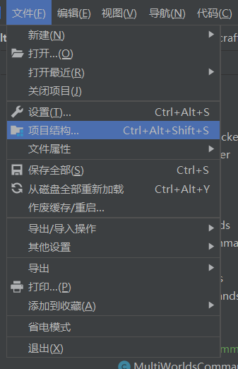

# 安装与配置

### 如何安装/导入

首先下载UltiTools的jar文件。

[UltiTools 最新版本/历史版本下载](https://github.com/wisdommen/wisdommen.github.io/tree/master/collections/Ultitools)

### 使用IDEA从本地JAR导入

打开项目 File –&gt; Project Structure



点击 Libraries -&gt; new -&gt; Java


然后选择你下载的UltiTools-x.x.x.jar文件，点击添加至模组，就完成了本地的jar导入。

### 使用Maven从本地JAR导入

在项目文件夹根目录中创建一个lib文件夹，并且将JAR文件放入其中。

接下来在pom.XML文件中添加以下的依赖

```markup
<dependencies>
    <dependency>
        <groupId>com.minecraft.UltiKits</groupId>
        <artifactId>UltiTools</artifactId>
        <version>UltiTools的jar文件版本</version>
        <scope>system</scope>
        <systemPath>${project.basedir}/lib/UltiTools的jar文件名称.jar</systemPath>
    </dependency>
</dependencies>
```

刷新Maven即可完成导入。

